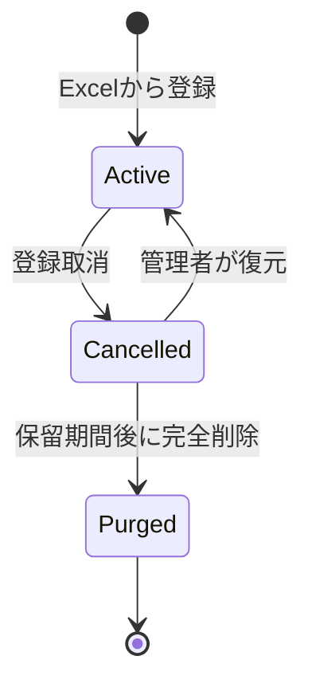

# 取消済みモジュールデータ管理方針

## 1. 目的

誤って登録したモジュールを通常業務から除外しつつ、誤操作への備えと監査証跡を確保する。

論理削除されたデータが増え続けることによるDB・画像ストレージ・バックアップへの影響を抑えるため、取消、復元、完全削除までの運用ルールを定める。

## 2. 対象環境と対象データ

最初はLab環境のモジュールを対象とする。Labで運用を確認した後、Standardへ反映する。

対象データ:

- `proc.modules`
- `proc.module_versions`
- `proc.module_rows`
- `proc.module_row_images`
- `proc.module_similarity_signatures`
- `proc.module_folder_memberships`
- `proc.module_approval_status_histories`
- `storage/lab/module_images`配下の画像ファイル

`archived`のモジュール版は過去の業務記録であり、取消済みデータには含めない。

## 3. 現在の実装

モジュール登録取消では、`proc.modules`に次の値を保存して論理削除する。

| カラム | 内容 |
| --- | --- |
| `deleted_at` | 取消日時 |
| `deleted_by` | 取消実行者 |
| `delete_reason` | 取消理由 |

取消済みモジュールは通常の一覧、検索、詳細、版管理、承認管理、画像取得、類似モジュール検索から除外される。

登録取消が許可されるのは、次の条件をすべて満たす場合に限る。

- モジュール版が初版1件だけである
- 版の状態が`draft`である
- 原本の`blueprint_items`から参照されていない
- まだ取消済みではない

取消後もDBレコードと抽出画像は保持される。`source_xlsx_path`は取込元ファイル名・パスの情報であり、現在のAPIはアップロードされたExcel本体を保存していない。そのため、完全削除処理から利用者PCや外部フォルダのExcelを削除しない。

## 4. 基本方針

| 項目 | 方針 |
| --- | --- |
| 通常の登録取消 | 論理削除とする |
| 取消済みデータの確認 | 管理者専用一覧で確認する |
| 保留期間 | 取消日から30日間を初期値とする |
| 保留期間中 | 管理者による復元を許可する |
| 完全削除 | 保留期間経過後に管理者が1件ずつ実行する |
| 自動削除 | MVPでは行わない |
| 証跡 | 完全削除後も監査ログを残す |
| モジュールキー | 復元可能期間中は再利用しない |

保留期間は将来、環境変数などで変更可能にする。初期値の30日はPoC運用で妥当性を確認する。

## 5. データの状態遷移



| 状態 | DBレコード | 画像 | 通常画面 | 管理者画面 |
| --- | --- | --- | --- | --- |
| 通常 | 保持 | 保持 | 表示 | 表示 |
| 取消済み | 保持 | 保持 | 非表示 | 表示 |
| 完全削除済み | 削除 | 削除対象 | 非表示 | 監査ログのみ表示 |

## 6. 管理者画面

管理メニューに「取消済みモジュール」を追加する。

一覧に表示する項目:

- モジュールID
- モジュールキー
- モジュール名
- 登録者
- 登録日時
- 取消者
- 取消日時
- 取消理由
- 保留期間の残日数
- 関連画像数
- 操作

操作:

- 詳細確認
- 復元
- 完全削除

完全削除ボタンは保留期間経過後だけ有効にする。対象を取り違えないよう、確認ダイアログでモジュールキーの再入力を必須とする。

## 7. 復元ルール

復元は管理者だけが実行できる。

復元時に次を再確認する。

- 対象が取消済みである
- 完全削除されていない
- 同じモジュールキーを持つ別データが存在しない
- DBレコードと画像メタデータが破損していない

復元では`deleted_at`、`deleted_by`、`delete_reason`を`NULL`に戻す。取消と復元の履歴は監査ログに残すため、取消理由は失われない。

復元後の状態は、取消前と同じ`draft`とする。自動で承認依頼は行わない。

## 8. 完全削除ルール

完全削除は次の条件をすべて満たす場合に限る。

- 対象が論理削除済みである
- `deleted_at`から保留期間が経過している
- 原本から参照されていない
- 案件CSや実行記録から直接参照されていない
- 実行者が管理者である
- 完全削除理由が入力されている
- 確認ダイアログにモジュールキーが正しく再入力されている

削除直前に条件を再判定し、1件でも満たさない場合は処理を中止する。

## 9. 完全削除の処理順

完全削除はモジュール1件単位のトランザクションとして扱う。

1. 対象モジュールをロックする
2. 論理削除状態、保留期間、参照有無を再確認する
3. 削除対象の画像パスと件数を監査ログ用データへ記録する
4. `proc.module_versions`を削除する
5. `proc.modules`を削除する
6. DBトランザクションを確定する
7. 他の画像メタデータから参照されていない画像ファイルだけ削除する
8. ファイル削除結果を監査ログへ記録する

現在の外部キーにより、モジュール版を削除すると行、行画像メタデータ、類似検索用データ、承認履歴が連鎖削除される。フォルダ・タグの関連付けはモジュール削除時に連鎖削除される。

画像ファイルの削除に失敗してもDBの完全削除を巻き戻さない。監査ログに失敗したパスを保存し、管理者が再実行できるようにする。

## 10. 監査ログ

完全削除後は元のモジュールレコードが存在しないため、外部キーを持たない専用テーブルへ証跡を保存する。

テーブル案: `proc.module_deletion_audit_logs`

| カラム | 内容 |
| --- | --- |
| `audit_log_id` | 監査ログID |
| `module_id_snapshot` | 操作時点のモジュールID |
| `module_key` | モジュールキー |
| `module_name` | モジュール名 |
| `operation` | `cancel`、`restore`、`purge` |
| `operated_by` | 実行者 |
| `reason` | 操作理由 |
| `operated_at` | 実行日時 |
| `metadata_json` | 版数、行数、画像数、ファイル削除結果など |

監査ログ自体は管理画面から削除できないようにする。監査ログの保存期間は社内ルール確定後に別途定める。

## 11. 権限制御

完全削除は復元できないため、画面の表示制御だけでは実行を許可しない。

最終構成では、バックエンドが認証済みユーザーと`admin`ロールを確認する。フロントエンドから送られた`operated_by`だけを信用しない。

現在のMVPはユーザー情報をブラウザの`localStorage`に保持しており、バックエンド認証が未実装である。この状態で完全削除APIを一般公開することは避ける。

LabでUIと削除条件を検証する間は、次のいずれかでAPIを保護する。

- 管理ネットワークからだけアクセス可能にする
- 管理者用の一時的な秘密値をAPIで検証する
- バックエンド認証実装後に完全削除を有効化する

本番導入時はバックエンド認証を必須とする。

## 12. API案

| メソッド | パス | 用途 |
| --- | --- | --- |
| `GET` | `/api/v1/admin/modules/cancelled` | 取消済み一覧取得 |
| `GET` | `/api/v1/admin/modules/cancelled/{module_id}` | 取消済み詳細取得 |
| `POST` | `/api/v1/admin/modules/cancelled/{module_id}/restore` | 復元 |
| `DELETE` | `/api/v1/admin/modules/cancelled/{module_id}` | 完全削除 |
| `GET` | `/api/v1/admin/modules/deletion-audits` | 監査ログ取得 |

完全削除リクエスト例:

```json
{
  "module_key_confirmation": "MOD-004",
  "reason": "保留期間を経過し、業務利用しないことを確認したため"
}
```

実行者は将来、認証情報からバックエンドが決定する。

## 13. 容量と運用監視

月1回を目安に次を確認する。

- 取消済み件数
- 取消済みデータの最古日
- `proc`スキーマのDB容量
- `storage/lab/module_images`の容量
- 完全削除待ち件数
- 画像ファイル削除の失敗件数
- DBバックアップのサイズと所要時間

件数が少ないPoC期間中は手動確認でよい。本番運用では容量のしきい値を決め、超過時に管理者へ通知する。

## 14. 実装段階

### 段階1: Lab管理機能

- 取消済み一覧API・画面
- 取消済み詳細表示
- 取消・復元・完全削除の監査ログ
- 管理者による復元
- 保留期間と参照条件の表示

### 段階2: Lab完全削除

- 完全削除API
- モジュールキー再入力による確認
- DB関連データの削除
- 未参照画像ファイルの削除
- 削除失敗時の記録と再実行

### 段階3: Standard反映前

- バックエンド認証・管理者認可
- 保持期間と監査ログ保存期間の社内合意
- バックアップ・復元手順の確認
- Labでの操作テストと容量確認

## 15. MVP受入条件

- 一般ユーザーから取消済みモジュールが見えない
- 管理者は取消済みモジュールと取消理由を確認できる
- 管理者は保留期間中のモジュールを復元できる
- 原本から参照されているモジュールを完全削除できない
- 保留期間前のモジュールを完全削除できない
- 完全削除対象をモジュールキーで再確認できる
- 完全削除後も実行者、日時、理由、対象キーが監査ログに残る
- 画像削除に失敗した場合、失敗内容を確認して再実行できる

## 16. 決定が必要な事項

次の値はPoCを回しながら最終決定する。

- 保留期間を30日とするか
- 監査ログの保存期間
- 画像ファイル削除失敗時の再実行方法
- Standardで使用する認証・認可方式
- 完全削除を実行できる管理者の範囲

