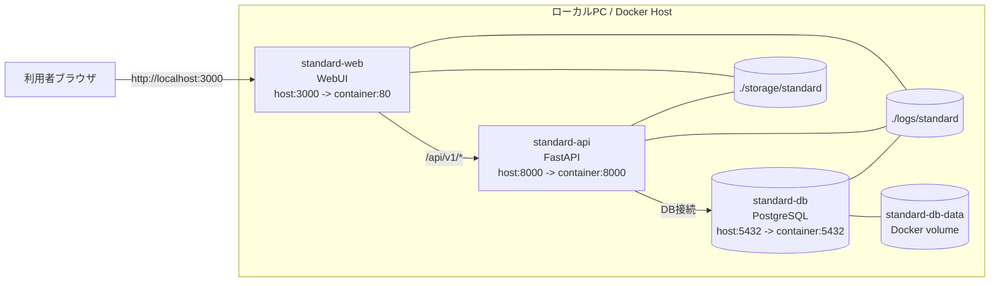
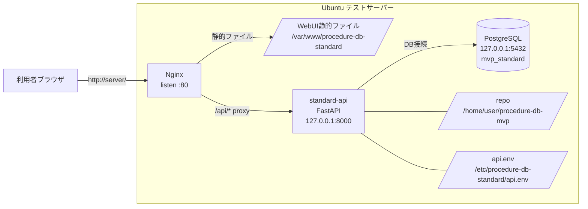

# サーバー構成・NW構成メモ（2026-06-04時点）

## 1. 対象

本資料は、Procedure DB MVP の `standard` 環境について、現在のローカルDocker構成とテストサーバー構成を整理する。

`lab` 環境はDBのみ定義されているが、現時点の主対象は `standard` とする。

## 2. ローカルDocker構成

ローカル開発では `docker-compose.standard.yml` を使用する。

### 2.1 サービス一覧

| サービス | 役割 | コンテナ内ポート | ホスト公開 | 備考 |
| --- | --- | --- | --- | --- |
| `standard-web` | WebUI配信 | `80` | `3000` | React/Viteのビルド成果物をNginx等で配信 |
| `standard-api` | FastAPI backend | `8000` | `8000` | `/api/v1/*` を提供 |
| `standard-db` | PostgreSQL | `5432` | `5432` | DB名 `mvp_standard` |

### 2.2 ローカルアクセスURL

| 用途 | URL |
| --- | --- |
| WebUI | `http://localhost:3000/` |
| API health | `http://localhost:8000/api/v1/health` |
| DB health | `http://localhost:8000/api/v1/health/db` |

### 2.3 ローカルDocker構成図



## 3. テストサーバー構成

テストサーバーでは Docker Compose ではなく、Ubuntu上に以下を配置する構成になっている。

- Nginx
- systemd管理の FastAPI
- PostgreSQL
- 静的WebUI配信ディレクトリ

過去手順では `192.168.10.5` を例にしているが、IPアドレスは変更される可能性がある。

### 3.1 サービス一覧

| コンポーネント | 役割 | 待受 | 備考 |
| --- | --- | --- | --- |
| Nginx | WebUI配信・APIリバースプロキシ | `0.0.0.0:80` | `/api/` を backend へ転送 |
| `standard-api` systemd service | FastAPI backend | `127.0.0.1:8000` | 外部には直接公開しない |
| PostgreSQL | DB | `127.0.0.1:5432` | DB名 `mvp_standard` |

### 3.2 テストサーバー上の主なパス

| 用途 | パス |
| --- | --- |
| リポジトリ | `/home/user/procedure-db-mvp` |
| backend | `/home/user/procedure-db-mvp/apps/standard/backend` |
| frontend build | `/home/user/procedure-db-mvp/apps/standard/frontend/dist` |
| Web公開先 | `/var/www/procedure-db-standard` |
| API環境変数 | `/etc/procedure-db-standard/api.env` |
| systemd service | `/etc/systemd/system/standard-api.service` |

### 3.3 テストサーバーURL

| 用途 | URL例 |
| --- | --- |
| WebUI | `http://<server-ip>/` |
| 案件化画面 | `http://<server-ip>/case-docs` |
| API health | `http://<server-ip>/api/v1/health` |
| DB health | `http://<server-ip>/api/v1/health/db` |

### 3.4 テストサーバーNW構成図



## 4. データ配置

### 4.1 DB

DBはPostgreSQLを使用する。

| 環境 | DB名 | ユーザー | ポート |
| --- | --- | --- | --- |
| ローカルDocker | `mvp_standard` | `standard_user` | `5432` |
| テストサーバー | `mvp_standard` | `standard_user` | `5432` |

### 4.2 ストレージ

ローカルDockerでは以下をコンテナへマウントする。

```text
./storage/standard:/app/storage
./logs/standard:/app/logs
```

主な用途:

| パス | 用途 |
| --- | --- |
| `storage/standard/access_exports` | AccessDB抽出Excelファイル配置 |
| `storage/standard/module_images` | Excel投入時に抽出した画像 |
| `logs/standard` | アプリ・DBログ |

## 5. アプリケーション内の通信

### 5.1 WebUIからAPI

WebUIは `/api/v1/*` のAPIを呼び出す。

ローカルDockerでは、ブラウザから見たAPIは主に以下になる。

```text
http://localhost:8000/api/v1/*
```

テストサーバーでは、Nginxが `/api/` を backend にプロキシする。

```text
http://<server-ip>/api/v1/*
  ↓ Nginx
http://127.0.0.1:8000/api/v1/*
```

### 5.2 APIからDB

APIはPostgreSQLへ接続する。

主な環境変数:

```text
DB_HOST=127.0.0.1
DB_PORT=5432
DB_NAME=mvp_standard
DB_USER=standard_user
DB_PASSWORD=standard_password
```

ローカルDockerでは、compose内のネットワーク上で `standard-db` へ接続する構成になる。

## 6. AccessDB / CDCreator 周辺の位置づけ

### 6.1 AccessDB

AccessDB本体は、現時点では会社PC上に存在する想定。
MVP backend は AccessDB へ直接接続しない。

運用イメージ:

```text
会社PC上のAccessDB
  ↓ VBAマクロなどでExcel抽出
Access抽出Excel
  ↓ 配置
storage/standard/access_exports
  ↓
standard-apiが読み取り
```

### 6.2 CDCreator

CDCreatorはExcel/VBAツールとして扱う。
MVP backend上でVBAを実行するのではなく、案件CSテンプレート `.xlsm` に CDCreator のVBAと補助シートを組み込む方針。

運用イメージ:

```text
case_doc_template.xlsm
  + CDCreator VBA
  + command_template
  + プロンプト
  + Log
  ↓
案件CS生成API
  ↓
CDCreator入り案件CS.xlsm
  ↓
利用者がExcelでマクロ実行
  ↓
CD用Excel出力
```

## 7. ローカルDocker起動・確認

```powershell
docker compose -f docker-compose.standard.yml up -d --build
docker compose -f docker-compose.standard.yml ps
```

確認URL:

```text
http://localhost:3000/
http://localhost:8000/api/v1/health
http://localhost:8000/api/v1/health/db
```

## 8. テストサーバー反映

反映スクリプト:

```text
infra/ubuntu/setup_standard_server.sh
infra/ubuntu/finish_standard_server.sh
```

役割:

- backend依存関係インストール
- DBスキーマ適用
- systemd service作成・再起動
- frontend distを `/var/www/procedure-db-standard` へ配置
- Nginx設定
- health check
- 静的asset配信確認

## 9. 注意点

- テストサーバーIPは固定とは限らない。
- `192.168.10.5` は過去手順上の例として扱う。
- `standard-api` はテストサーバー上では `127.0.0.1:8000` に閉じる。
- 外部公開はNginxの `:80` 経由。
- AccessDBはbackendから直接読まない。
- CDCreatorのVBAはサーバーでは実行しない。
- 実データExcelや画像はGit管理しない。

